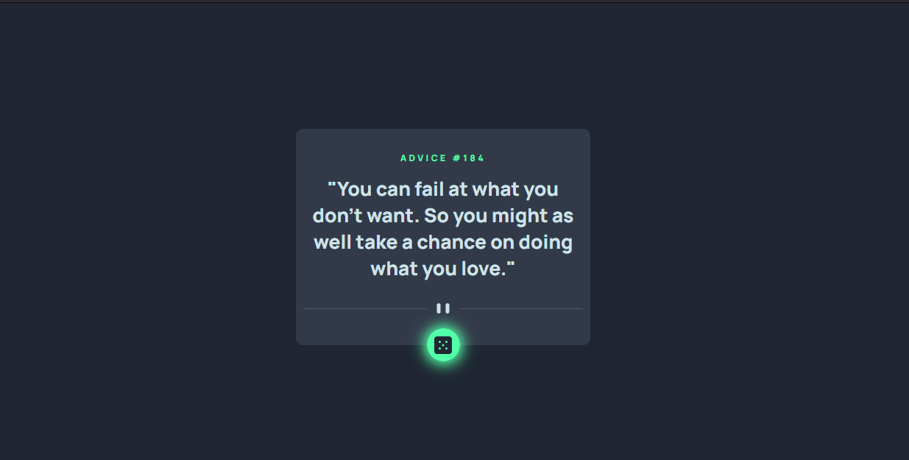

# Frontend Mentor - Advice generator app solution

This is a solution to the [Advice generator app challenge on Frontend Mentor](https://www.frontendmentor.io/challenges/advice-generator-app-QdUG-13db). Frontend Mentor challenges help you improve your coding skills by building realistic projects.

## The challenge

Users should be able to:

- View the optimal layout for the app depending on their device's screen size
- See hover states for all interactive elements on the page
- Generate a new piece of advice by clicking the dice icon

## Screenshot

## Links

- Solution URL: [Github repo](https://github.com/JustShuaib/advice-generator)
- Live Site URL: [Live site](https://advice-generator-shuaib.netlify.app/)

## Built with

- Semantic HTML5 markup
- CSS
- Mobile-first workflow
- JavaScript
- [Advice slip API](https://api.adviceslip.com/)

## Continued development

I love that I had to play around with animations in this project.
I would definitely add more animation to my subsequent applications 😊.

## Useful resources

- [Async function MDN](https://developer.mozilla.org/en-US/docs/Web/JavaScript/Reference/Statements/async_function) - Async await MDN

## Author

- Github - [Adeoti Shuaib](https://www.github.com/JustShuaib)
- Frontend Mentor - [@justshuaib](https://www.frontendmentor.io/profile/justshuaib)
- Twitter - [@JustShuaib](https://www.twitter.com/JustShuaib)

## Extra

I added animation to the advice when it is displayed
